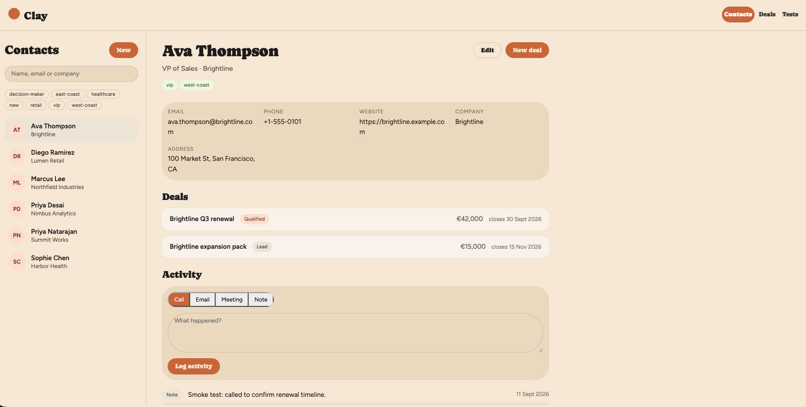

# Simple CRM

A lightweight CRM MVP for managing client relationships: contacts, their activity history, and a single-pipeline view of deals.

## Domain model

- **Contact** — a person, belonging to exactly one company (a field, not a separate entity).
- **Activity** — a call, email, meeting, or note logged against a contact.
- **Deal** — a sales opportunity tied to one contact, moved manually through pipeline stages (including Won/Lost).

There is one pipeline, no automation, and no separate company entity — see [CLAUDE.md](CLAUDE.md) for the full scope.

## Stack

- **Backend**: FastAPI + SQLAlchemy (`backend/`)
- **Frontend**: static HTML/CSS/JS (`_frontend/`)

## Running locally

```bash
make run            # backend API on :8091
make run-frontend    # frontend on :8092
make test            # backend test suite
make test-frontend   # frontend services-layer tests (Node)
make test-integration  # API tests against the Docker Compose stack
make test-e2e        # Playwright browser tests against the Docker Compose stack
```

CI/CD runs all of these on GitHub Actions and, once GCP is configured and a
reviewer approves, deploys `main` to Google Cloud (Cloud Run behind
Identity-Aware Proxy): see [_docs/deploy-gcp.md](_docs/deploy-gcp.md#cicd-github-actions).

## Interface



Contact detail view showing profile info, associated deals, and activity history/logging.
